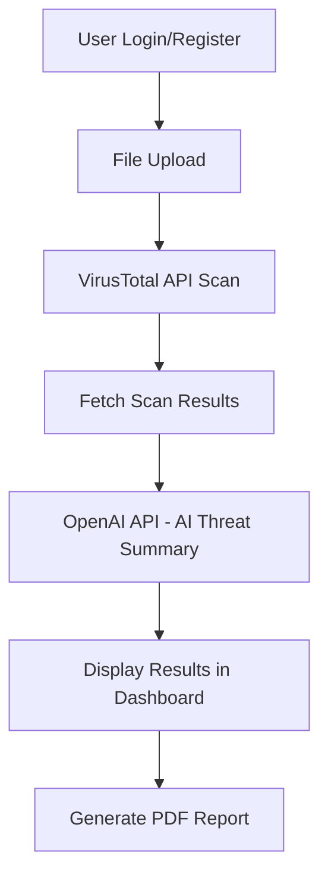

# Project-secure-ai-virus-scanning-portal

## SecureAI Virus Scanning Portal
A simple web-based virus scanning portal built with PHP and MySQL. Users can upload files for scanning via the VirusTotal API and receive AI-generated summary reports using OpenAI API. Includes user authentication, scan history, and PDF report export functionality.

Repository URL: [https://github.com/vaishnavucv/Project-secure-ai-virus-scanning-portal/](https://github.com/vaishnavucv/Project-secure-ai-virus-scanning-portal/)

## 📌 Project Title:

**SecureAI Virus Scanning Portal: AI-driven Malware Detection and Reporting System**

## 📖 Abstract:

This project focuses on developing a web-based **Virus Scanning and Reporting Portal** that integrates traditional malware scanning (using VirusTotal API) with **AI-driven summarization** (OpenAI API). The solution allows users to upload files, receive detailed scan reports, get AI-generated threat summaries, and download professional PDF reports. This repository aims to help university, college, and school students explore cybersecurity and artificial intelligence concepts in real-world projects.

## 🎯 Objectives:

* Enable students to understand how Virus Scanning APIs work.
* Integrate AI models for automated threat summarization.
* Allow secure user authentication and file handling in web apps.
* Generate downloadable PDF security reports.
* Provide a scalable LAMP-based deployment model.

## 🏗️ Project Workflow Diagram:



## 🧱 Technology Stack:

* **Frontend:** HTML5, CSS3, Bootstrap
* **Backend:** PHP 8.x
* **Database:** MySQL / MariaDB
* **External APIs:**

  * VirusTotal API (for file scanning)
  * OpenAI API (for AI Summary)
* **PDF Report Generation:** TCPDF / DomPDF
* **Deployment:** Apache Server (XAMPP, LAMP, or Shared Hosting)

## 🗄️ MySQL Database Schema:

| Table Name    | Description                 |
| ------------- | --------------------------- |
| users         | User authentication data    |
| uploads       | Uploaded file metadata      |
| scan\_results | VirusTotal scan report data |
| ai\_summaries | AI-generated summaries      |
| logs          | Optional user activity logs |

## 🔎 Solution Overview:

1. **User Authentication:** Secure login/registration system with password hashing.
2. **File Upload:** Users upload files for malware scanning.
3. **VirusTotal API Integration:** The backend sends files for scanning and retrieves JSON-based scan reports.
4. **AI-Powered Summary:** OpenAI API generates a human-readable, risk-focused summary from scan results.
5. **Report Generation:** The system generates a downloadable PDF report.
6. **User Dashboard:** Users can view their upload history, scan results, and download past reports.

## 📍 Development Phases:

| Phase   | Description                         |
| ------- | ----------------------------------- |
| Phase 1 | User Authentication Module          |
| Phase 2 | File Upload & Validation Module     |
| Phase 3 | VirusTotal API Scan Integration     |
| Phase 4 | AI Summary Integration (OpenAI API) |
| Phase 5 | PDF Report Generation               |
| Phase 6 | Dashboard UI for users              |
| Phase 7 | Deployment & Testing                |

## 🚀 Deployment Instructions:

### Requirements:

* PHP 8.x
* MySQL / MariaDB
* Apache (XAMPP / LAMP / Hosting Provider)

### Steps:

1. Clone the repository:

   ```bash
   git clone https://github.com/vaishnavucv/Project-secure-ai-virus-scanning-portal.git
   ```
2. Import `database.sql` into your MySQL server.
3. Configure your API Keys in `config.php`:

   ```php
   define('VT_API_KEY', 'your_virustotal_api_key');
   define('OPENAI_API_KEY', 'your_openai_api_key');
   ```
4. Place the project inside your Apache server `htdocs` or `/var/www/html`.
5. Start Apache and MySQL services.
6. Access the portal via:

   ```
   http://localhost/Project-secure-ai-virus-scanning-portal/
   ```

## 🎯 Project Scope:

* Educational Use (School/College Projects)
* Basic Malware Scanning Demo
* AI Text Summarization Practice
* Secure PHP Web Development Practice

## ✅ Features Implemented:

* Secure user login/signup
* File upload with validation
* VirusTotal API scanning
* AI-generated risk summary (OpenAI API)
* PDF report export
* User dashboard for history tracking

## 🚧 Future Enhancements:

* Admin panel for managing users and scans
* Real-time progress indication for file scans
* Email notifications after scan completion
* File size optimization with hash pre-checks

## ✨ Educational Value:

This project allows students to explore:

* API integrations in PHP
* Secure coding practices
* Working with external APIs (VirusTotal, OpenAI)
* Cybersecurity application development
* AI-driven reporting in web applications

---

> **Maintained by:** [Vaishnavu C V](https://github.com/vaishnavucv/)

**Repository Purpose:** To help students build cybersecurity and AI-driven projects with industry relevance.

---

**If you use this project, give a ⭐️ to support open-source student projects!**
